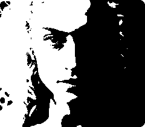

# README
---
This code demonstrates a simple image thresholding algorithm implemented using SYCL. It is fully compatible with the ParaS SYCL compiler, enabling efficient compilation and execution across heterogeneous computing platforms. With support for both CPU and GPU targets, it allows developers to exploit device-level parallelism while ensuring performance portability. By utilizing the ParaS compiler, users can seamlessly compile and run this SYCL-based image thresholding application on a range of hardware backends.

## Compilation
This code can be compiled using the ParaS compiler for both CPU and GPU targets as specified below.

### For CPUs

For any CPUs:

`parascc image_thresholding_sycl.cpp -o thresholding pkg-config --cflags --libs opencv4`

### For NVIDIA and AMD GPUs

`parascc image_thresholding_sycl.cpp -o thresholding -parasdevice [cuda:sm_<x> / hip:gfx<x>] pkg-config --cflags --libs opencv4`

> [!NOTE]  
> For AMD GPUs use `hip:gfx<x>`  
> For NVIDIA GPUs use `cuda:sm_<x>`  
> where x is the compute capability of GPU device.

## Expected Output

**Input 1:**

**Output 1:**

**Input 2:**

**Output 2:**

